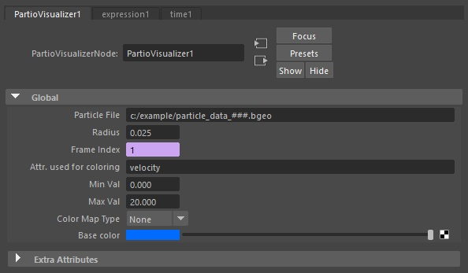
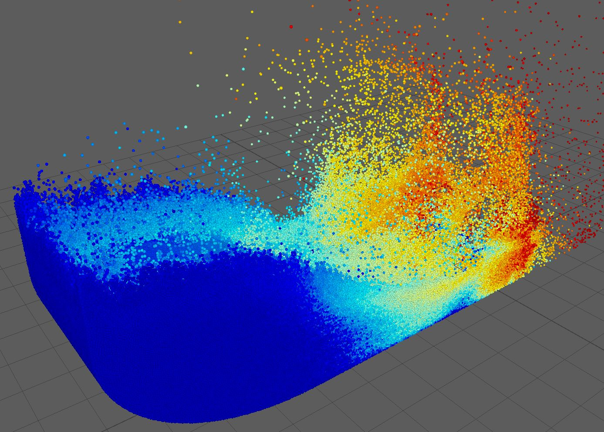
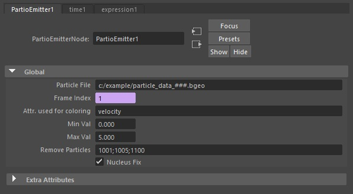
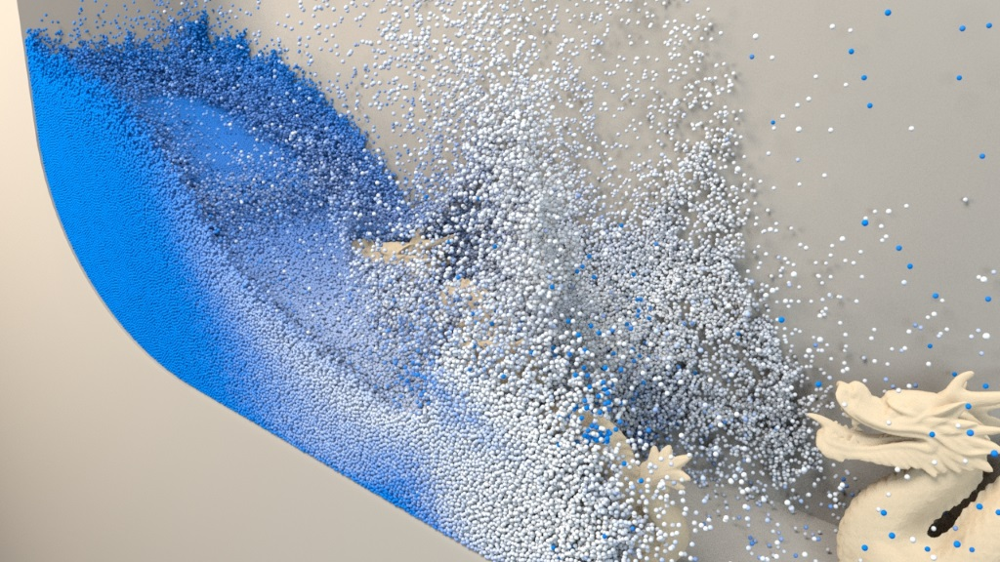

MayaPartioTools is an open-source plugin to visualize and import particle data in Maya. The plugin can handle all file formats that are supported by the [Partio](https://www.disneyanimation.com/technology/partio.html) library.

This plugin can be used to import and render the particle data generated with our fluid simulation library:
- [https://github.com/InteractiveComputerGraphics/SPlisHSPlasH](https://github.com/InteractiveComputerGraphics/SPlisHSPlasH)

**Author**: [Jan Bender](http://www.interactive-graphics.de), **License**: MIT

## Features

* an open-source Maya plugin to import Partio data
* adds a visualizer node which enables a quick preview using OpenGL rendering
* imports particle data in the particle system of Maya (nParticles)

## Build Instructions

This project is based on [CMake](https://cmake.org/). To build the plugin, the Maya devkit must be installed. If you tell CMake which Maya version you are using, CMake will search for the Maya headers and libraries in the usual Maya directories. CMake generates project files, Makefiles, etc. and then you can compile the project with a compiler of your choice that supports C++11. 

The code was tested with the following configurations:
- Windows 10 64-bit, CMake 3.11.2, Visual Studio 2017
- Debian 9 64-bit, CMake 3.12.3, GCC 6.3.0.

## Installation

Just load the plugin in Plug-in Manager of Maya. 

Note: The plugin needs the scripts directory. So if you copy the plugin, also copy the scripts folder. 

Important: 
The following configuration should be used since otherwise Maya has problems to load the data correctly. In the menu choose "Windows -> Settings/Preferences -> Preferences". Then set "Settings/Animation -> Evaluation mode" to "DG".

## Usage

After loading the plugin a new menu appears which is called "Partio Tools". It allows you to create the node types:

* PartioVisualizerNode: This node allows you to visualize large sets of particles in the Maya UI using OpenGL. Typically this can be used to generate a quick preview. 
* PartioEmitterNode: This node reads particle data from any Partio format and generates Maya nParticles. In this way the particles can be rendered. 

### PartioVisualizerNode

 

This node can visualize large sets of particles in Maya's viewport 2.0 using OpenGL and some shader programs. The PartioVisualizerNode can be used to get a quick preview of a particle file sequence.

* Particle File: Location of your particle files (e.g. c:/example/particle_data_#.bgeo), where # is a placeholder for the index
* Radius: The particle radius
* Frame Index: The index of the frame which should be loaded. By default a expression is used to set this index to the current time index but this expression can also be changed in Maya.
* Attr. used for coloring: Attribute in the partio file which should be used for coloring the particles. Any float or vector field can be used.
* Min val: The minimum value of the attribute used for coloring. Smaller values will be clamped.
* Max val: The maximum value of the attribute used for coloring. Larger values will be clamped.
* Color Map Type: Choice of a color map used for coloring. If this is set to none, then the base color is used for the minimum value and white for the maximum value.  
* Base Color: Color used if no color map is selected.

### PartioEmitterNode

 

The PartioEmitterNode imports particles from partio files in Maya. If you create a new PartioEmitterNode, the plugin will also create an nParticle node and connect both. So your particles are imported in Maya's nParticle system. 
Moreover, an aiStandardSurface will be created and connected with a ramp that is used to color the particles. The color depends on the user-defined scalar or vector field (Attr. used for coloring).

* Particle File: Location of your particle files (e.g. c:/example/particle_data_#.bgeo), where # is a placeholder for the index
* Frame Index: The index of the frame which should be loaded. By default a expression is used to set this index to the current time index but this expression can also be changed in Maya.
* Attr. used for coloring: Attribute in the partio file which should be used for coloring the particles. Any float or vector field can be used.
* Min val: The minimum value of the attribute used for coloring. Smaller values will be clamped.
* Max val: The maximum value of the attribute used for coloring. Larger values will be clamped.
* Remove particles: This attribute can be used to remove single particles by their index when loading the file. The indices of multiple particles must be separated by a semicolon (e.g. 1001;1005;1100). 
* Nucleus Fix: Maya sometimes crashed when removing particles (in scenarios where the particle count varies over time). This fix solved this problem. When enabled, particles are not removed, they are just moved to a place where the camera cannot see them.